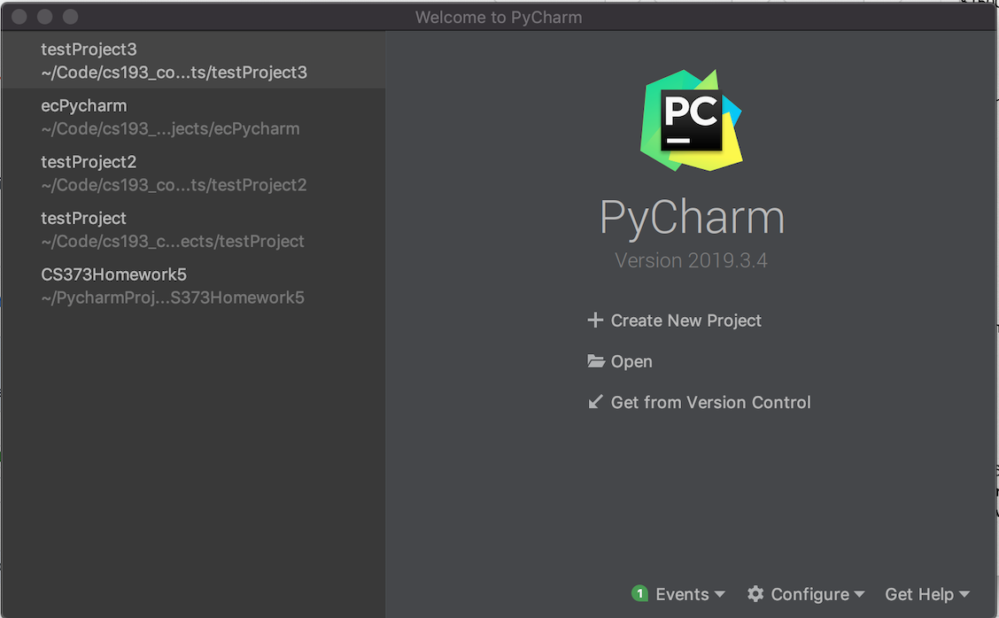
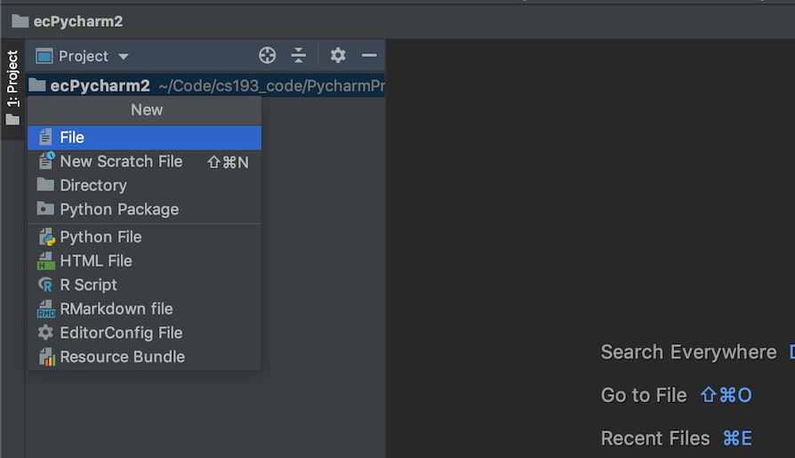
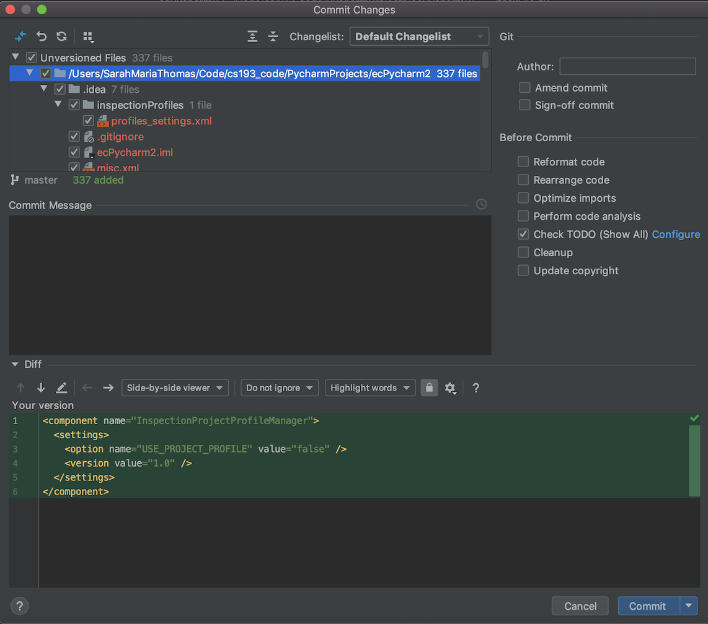

# PyCharm Task

In this task, you will practice cloning and pushing changes from/to a remote repository using PyCharm, a popular IDEA used for projects written in the Python programming language.

## WHAT TO DO

If not yet installed on your computer, download the PyCharm IDE (the free, open-source version) [at this link](https://www.jetbrains.com/pycharm/download/). 

Follow the necessary installation steps prompted by your computer.

**NOTE**: you will need a Python interpreter installed on your computer to use PyCharm. By default, Windows does not provide an interpreter, but you can download one from their website [here](https://www.python.org/downloads/) and clicking on the download button (make sure you get the Windows version). Mac and Linux both include an interpreter by default, so you should be good to go. If you for some reason do not have an interpreter (PyCharm will let you know if it can't find one), go to their website [here](https://www.python.org/downloads/) and click on the download button (make sure you get the version specific to your operating system).

PyCharm should automatically find your interpreter, but if it doesn't, you can search for it manually in your file explorer, then paste the complete path into the field during setup. Please let one of your TAs know if you run into any issues with this!

### Create empty repository
While PyCharm is downloading, navigate to _github.com_ on your web browser of choice. In the upper right corner, press the `+` button and select `New Repository`. Name it **ecPycharm**, make sure that "Public" is selected, then click `Create repository`.

### Create new PyCharm project
Open PyCharm. It should open to a window that looks like this:



Select `Create New Project`, and in the window that pops up afterward, fill in the **Location** field with _your\_preferred\_location/**ecPycharm**_ to store your project in your preferred location on your computer. Then select `Create`/ without modifying the other settings (the default should work).

In your newly created project, go to `File` > `New` > `File` as shown below. Name the file `taskFile.py`.



Copy the code below into `taskFile.py`:

```

def factorial(n):
    if n < 0:
        return 0
    elif n==1 or n == 0:
        return 1
    else:
        toReturn = 1
        while (n>1):
            toReturn *= n
            n -= 1
        return toReturn
print(factorial(5))

```

Right click (or click with two fingers) on the tab and select "Run 'taskFile'":


## Pushing your PyCharm project to GitHub (almost done!)

In PyCharm – at the toolbar at the top of your screen, select `VCS` > `VCS Operations Popup` > `Create Git Repository` > `Open`.  Then go back to the toolbar and select `VCS` > `Commit` and select the project folder as shown below:



Add a commit message, like "Created new project ecPycharm", and press `Commit`.

Go to `VCS` > `VCS Operations Popup` > `Push` > `Define Remote`. For the "URL" field, copy and paste the URL of the git repository **ecPycharm** your created earlier in your web browser. Select `Okay` and then click `Push`.

Navigate to your web browser and refresh the tab of your git repository – you should now see your project files.

Now, in Github, press the pencil icon to edit this file (pycharmTask.md). Add the link to your GitHub repository **ecPycharm** below:

[THIS IS MY GITHUB REPO LINK](paste link here between parentheses).

### You're done with this task!
